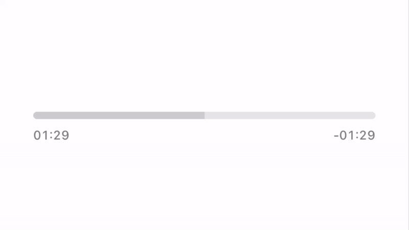
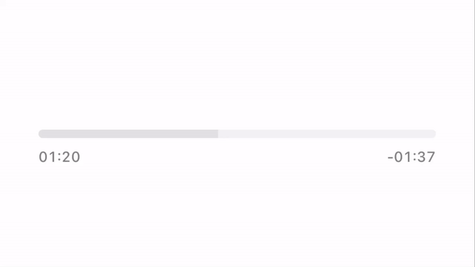
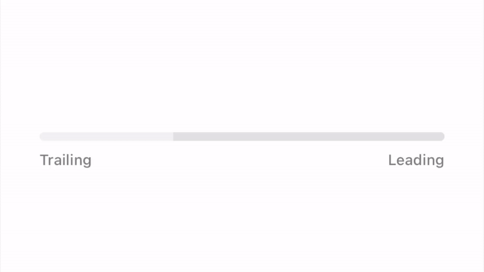

# SliderControl

SliderControl is a small Swift Package aiming to recreate volume and track sliders found in Apple Music on iOS 16 and later.



## Usage

`SliderControl` maintains an API similar to built-in `UISlider`. It has the same properties, like `value` and `isContinuous`. Progress observation is done the same way, by adding a target and an action:

```swift
sliderControl.addTarget(self, action: #selector(sliderValueChanged), for: .valueChanged)
```

## Customization

There are a few properties to customize `SliderControl`'s appearance:
- `defaultTrackColor` sets a track color for default state;
- `defaultProgressColor` sets a progress color for default state;
- `enlargedTrackColor` sets a track color for state when user actively changing the progress;
- `enlargedProgressColor` sets a progress color for state when user actively changing the progress.

The default value of `enlargedTrackColor` and `enlargedProgressColor` is `nil`, so the slider won't change color upon interaction in its default configuration. However, by setting different colors, you can configure the slider to change its appearance when user interacts with it. Here's an example: 



```swift
sliderControl.defaultTrackColor = .quaternarySystemFill
sliderControl.defaultProgressColor = .tertiarySystemFill
sliderControl.enlargedTrackColor = .secondarySystemFill
sliderControl.enlargedProgressColor = .systemFill
```

By default `SliderControl` provides haptic feedback when value reaches lower and upper bounds. This behavior can be changed by setting `providesHapticFeedback` property to `false`. Types of haptic feedback can also be changed by subclassing `SliderControl`:
```swift
class MySliderControl: SliderControl {
    override var feedbackGenerator: UIFeedbackGenerator {
        return UINotificationFeedbackGenerator()
    }

    override func provideHapticFeedbackForMinimumValue() {
        (feedbackGenerator as? UINotificationFeedbackGenerator)?.notificationOccurred(.error)
    }

    override func provideHapticFeedbackForMaximumValue() {
        (feedbackGenerator as? UINotificationFeedbackGenerator)?.notificationOccurred(.success)
    }
}
```

## RTL Support

`SliderControl` supports right-to-left languages.



## Requirements

- iOS 13+
- Swift 5.8